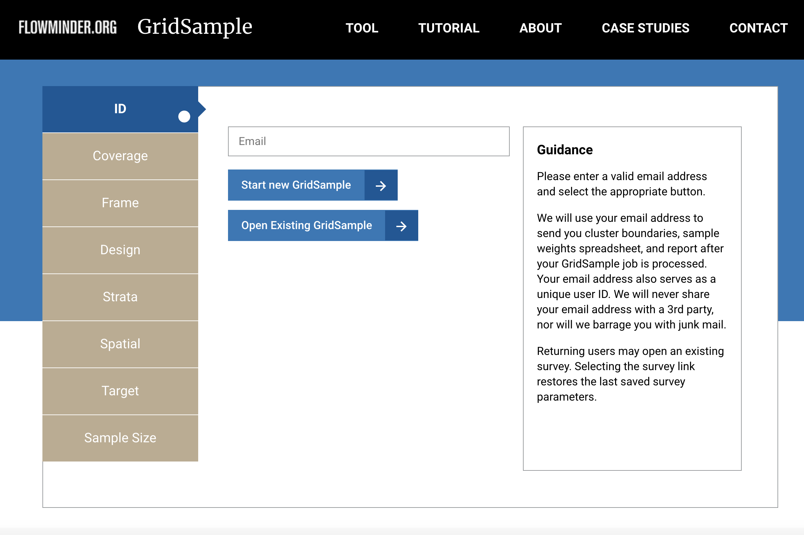

# GridSample2.0 

## Overview

GridSample2.0 is the sample selection algorithm behind the GridSample.org website. The tool provides a way to design complex household surveys with gridded population data.

> Some work will be needed to define the parameters needed to run the algorithm. If you have difficulty determining the parameters for your survey design, please refer to the click-and-point interface and guidance at [GridSample.org](http://gridsample.org/)

## Why use GridSample2.0?

In countries where census data are outdated, inaccurate or too geographically course to be used effectively as a survey sample frame, gridded population data are being used to select representative, complex household surveys.
 
Top-down gridded population data have been available for decades and represent
disaggregated census population counts in small grid cells. Disaggregation is based on spatial datasets such as land cover type and road locations. Two such datasets in particular - WorldPop and Landscan - have been used in dozens of published and unpublished gridded population surveys in low- and middle-income country (LMIC) surveys. WorldPop has the advantage of being free, having small ~100m X 100m cells (roughly the size of a city block), and representing residential population counts. Alternatively, many Landscan users must pay for data access, cells are ~1km X 1km, and the dataset represents a 24-hour ambient population averaging counts of nighttime residents and daytime commuters. Census-independent bottom-up gridded population datasets are expected to become available for many countries in 2019 based on satellite imagery and micro-census counts. GridSample2.0 assume use of WorldPop estimates.

Until recently, gridded population surveys were generated with adhoc tools and methods. However, gridded population sampling is becoming easier with tools such as [GridSample.org](http://gridsample.org/), a free click-and-point web tool designed for survey planners in LMICs. GridSample.org includes pre-loaded gridded population data and boundary datasets, and supports standard complex survey designs used in the Demographic and Health Surveys (DHS), Multiple Indicator Cluster Surveys (MICS), Living Standard Measurement Surveys (LSMS), and other routine surveys. 

[GridSample.org](http://gridsample.org/) is created by [Flowminder](https://flowminder.org), a non-profit organisation whose mission is to improve public health and wellbeing in LMICs using data from mobile operators, satellites, and geo-located household surveys.

## How to set up GridSample2.0?

The [technical documentation](GridSample2.0 Algorithm Technical Manual.pdf) provides detailed explanation of GridSample tool. Please refer to the [README](https://github.com/Flowminder/GridSample2.0/blob/master/GridSample/README.md) documentation provided which explains how to set up GridSample2.0.

